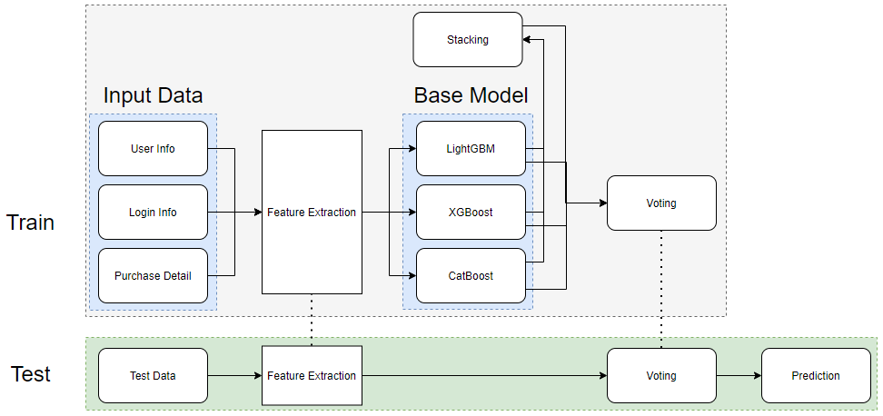
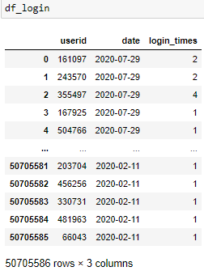
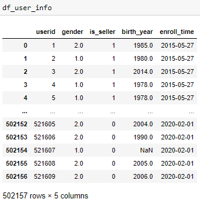
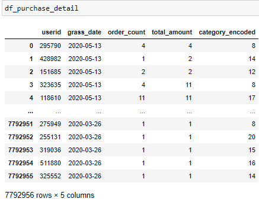
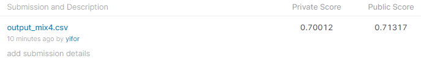

# High-Value-Customer-Forecast-Competition
[Open] I'm the Best Coder Challenge! 2020

# Goal
* Categorize high-value users from the user's purchase history in shoppe APP.
* Data: 426832 training data, 75325 test data 
* Target: normal user (label 0) or high-value user (label 1)

# Pipeline

# Result
* Team: Yi
* Rank: 10 / 60 (16%)
* Official Website: https://careers.shopee.tw/bestcoder/
* Leaderboard: https://www.kaggle.com/c/iamthebestcoderopen2020/leaderboard

# Feature Engineering

### Feature Idea
* RFM model

### User login 
* data

    

* Feature extraction
    * Statistics on `login_times` per `userid`
    * `date` count by `userid`
    
### User Info 
* data

    

* Feature extraction
    * `lifetime`: End time (20200731) to `enroll_time`
    * `age`: End year (2020) to `birth_year`
      
### Purchase Detail
* data

    

* Feature extraction
    * `epochtime`: epoch time of `grass_date`
    * `dt_diff`: `grass_date` difference by useridime`
    * `amount_per_order`: `total_amount`/ `order_count`
    * `cat_encode`: Frequence encoding of `category_encoded`
    * Statistics of `dt_diff`
    * Statistics of sum of `order_count` by `userid` and `category_encoded`
    * Statistics of count of `order_count` by `userid` and `category_encoded`
    * Statistics of sum of `total_amount` by `userid` and `category_encoded`
    * Statistics of `order_count`, `total_amount`, `cat_encode`, `amount_per_order`,`epochtime` by `userid`

# Method 

### In Competition
* Model : XGBoost, GBM, Deep Learning 
* Package : [`h2o.automl`](https://docs.h2o.ai/h2o/latest-stable/h2o-docs/automl.html)
* Skill : Grid search optimization, Stacking
* Score : 0.68177 (Private Leaderboard), 0.69018 (Public Leaderboard)
* Notebook: `main.ipynb`

### Late Submit
* Model : XGBoost, LightGBM, CatBoost
* Package : `xgboost.XGBClassifier`,`lightgbm.LGBMClassifier`,`catboost.CatBoostClassifier`,`sklearn.ensemble.StackingClassifier`
* Skill : Bayesian optimization, Calibration, Stacking
* Notebook: `late_submit.ipynb`
* Kaggle Score:
  
  

# Model Training Step
### In Competition
* Use stacknet ensemble XGBoost, GBM, Deep Learning with grid search by `h2o.automl`.

### Late Submit
* Use Bayesian optimization to tune XGBoost model. (Note: `scale_pos_weight` is an important hyperparameter)
* Use Bayesian optimization to tune LightGBM model. (Note: `max_bin` and `boosting` are important hyperparameters)
* Use the rule of thumb for Catboost hyperparameter.
* Stacking these three modes.
* Soft voting all of the above results.

# Conclusion
* The model hyperparameter adjustment has little effect on the results.
* The effect of the feature extraction results on the results is significant, especially the purchase history.
* LightGBM is a powerful model in this competition.
* Manual adjusting of the model architecture gives better results than the automl method.